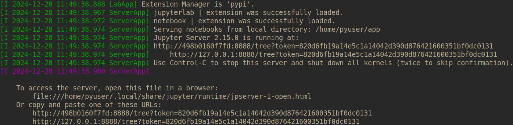
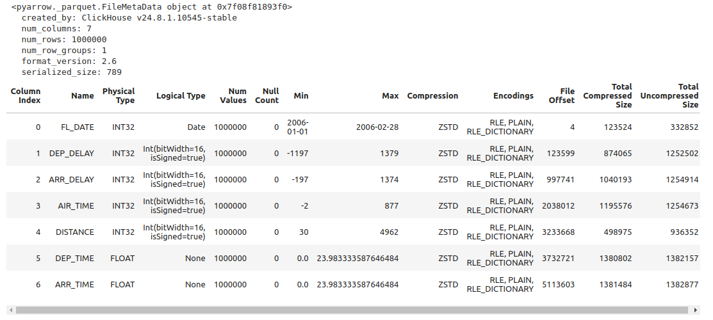
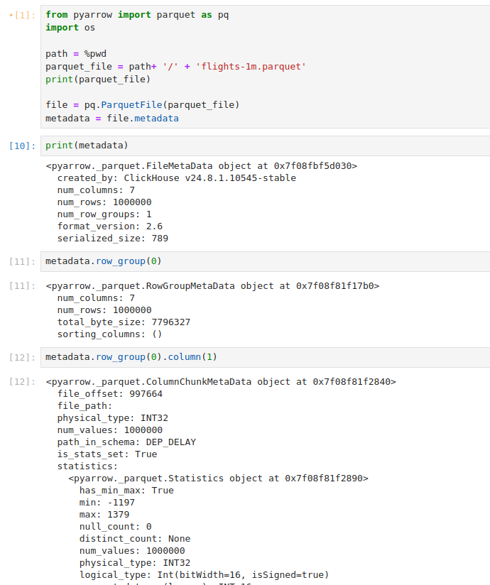

## Instructions: 

1. Clone this Repo using below clone command
```shell
git clone git@github.com:experientlabs/parquet_metadata.git
```

2. Bild image: 

```shell
docker build -t python_workbench .
```

3. Do a `chmod 777 app` to provide write access to app directory. You can follow other approach to provide access too.

4. Run container
```shell
hostfolder="$(pwd)"
dockerfolder="/home/sparkuser/app"
docker run -it --rm -p 8888:8888 -v ${hostfolder}/app:${dockerfolder} python_workbench jupyter
```

### Now you should be able to access jupyter notebook at:
localhost:8888

Just make sure that either you use the URL that is printed in the terminal while running docker run command.
Shown below:


Or use the localhost:8888 and then enter the token in the login box. 
This token is visible in terminal when you run the `docker run` command


```python
from pyarrow import parquet
from tabulate import tabulate
from IPython.display import HTML, display


# Open the Parquet file
parquet_file = 'flights-1m.parquet'
metadata = parquet.ParquetFile(parquet_file).metadata

print(metadata)
# Prepare data for tabular display
table_data = []
headers = [
    "Column Index", "Name", "Physical Type", "Logical Type", "Num Values",
    "Null Count", "Min", "Max", "Compression", "Encodings", "File Offset",
    "Total Compressed Size", "Total Uncompressed Size"
]

for column_index in range(metadata.num_columns):
    column_meta = metadata.row_group(0).column(column_index)
    name = metadata.schema.column(column_index).name
    physical_type = column_meta.physical_type
    logical_type = column_meta.statistics.logical_type if column_meta.statistics else "N/A"
    num_values = column_meta.statistics.num_values if column_meta.statistics else "N/A"
    null_count = column_meta.statistics.null_count if column_meta.statistics else "N/A"
    min_val = column_meta.statistics.min if column_meta.statistics else "N/A"
    max_val = column_meta.statistics.max if column_meta.statistics else "N/A"
    compression = column_meta.compression
    encodings = ", ".join(column_meta.encodings)
    file_offset = column_meta.dictionary_page_offset
    total_compressed_size = column_meta.total_compressed_size
    total_uncompressed_size = column_meta.total_uncompressed_size

    table_data.append([
        column_index, name, physical_type, logical_type, num_values, null_count,
        min_val, max_val, compression, encodings, file_offset,
        total_compressed_size, total_uncompressed_size
    ])

table_html = tabulate(table_data, headers=headers, tablefmt="html")

# Display the table with horizontal scrolling
html_content = f"""
<div style="overflow-x: auto; white-space: nowrap;">
    {table_html}
</div>
"""
display(HTML(html_content))
```


